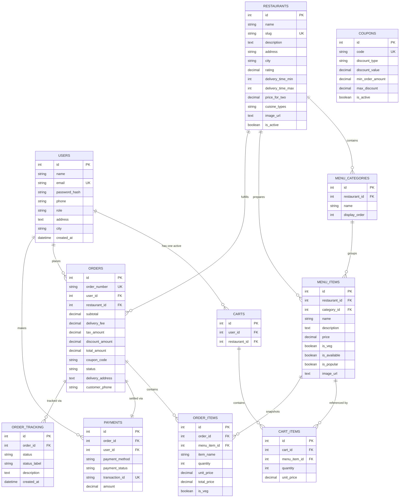

# CraveCart — Online Food Ordering System

> **A Production-Grade College Full-Stack Capstone Project**  
> Built with **React.js**, **Tailwind CSS**, **Node.js**, **Express.js**, **MySQL 8.0**, **Jest + Supertest**, **Docker**, and **Jenkins**.

[](https://render.com/deploy?repo=https://github.com/swayam699/online-food-ordering-system)

---

## 📌 Project Overview

**CraveCart** is a modern, commercial-style food ordering platform designed to avoid generic AI/vibe-coded clichés (no oversized gradients, no fake buttons, no repetitive cards, and no generic SaaS templates). It delivers an authentic culinary food-discovery experience with real-time multi-restaurant menus, intelligent cart management with restaurant switch conflict resolution, coupon validation, realistic multi-method payment simulation, and a dynamic database-driven order tracking interface.

The system features three distinct user roles:
1. **Customer:** Browse, live search dishes and restaurants, filter by cuisine/rating/price/veg, cart management, checkout with coupons and payment simulation, live order tracking, and order history.
2. **Restaurant Partner / Manager:** Menu management (CRUD), item availability toggle, live order acceptance/rejection, and order status updates.
3. **System Administrator:** Aggregated business metrics, revenue and orders analytics, customer management, restaurant catalog management, coupon campaign management, and live order dispatch control.

---

## 🛠️ Technology Stack

| Layer | Technologies Used |
| :--- | :--- |
| **Frontend** | React 18, Vite, Tailwind CSS 3.4, Lucide Icons |
| **Backend** | Node.js 20+, Express.js 4.21, CORS, Morgan |
| **Database** | MySQL 8.0 (Primary) + Zero-Downtime SQLite (Automatic Dev/Test Fallback) |
| **Authentication** | JSON Web Tokens (JWT), bcryptjs (Salt Rounds: 10) |
| **Testing** | Jest 29, Supertest 7 (23 passing integration tests) |
| **DevOps & CI/CD**| Docker, Docker Compose, Multi-stage Builds, Nginx, Jenkins Pipeline |
| **Version Control**| Git, GitHub-ready repository with `.gitignore` and `.env.example` |

---

## 🏛️ System Architecture

```mermaid
flowchart TD
    subgraph Client["Frontend Client (React 18 + Tailwind CSS)"]
        UI["Customer Web App & Admin Dashboard"]
        State["Auth Context & Cart Context"]
        API_Client["Lightweight API Client (JWT Bearer)"]
        UI --> State --> API_Client
    end

    subgraph Server["Backend REST API (Node.js + Express)"]
        Router["Express Router & API Endpoints"]
        AuthMiddleware["JWT Auth & Role Guard Middleware"]
        Controllers["Controllers (Auth, Rest, Menu, Cart, Order, Admin)"]
        Validation["Request Validation & Error Handlers"]
        Router --> AuthMiddleware --> Controllers
        Router --> Validation --> Controllers
    end

    subgraph DataLayer["Relational Database Layer"]
        DB_Adapter["Unified Database Driver (mysql2 / sqlite3)"]
        MySQL_DB[("MySQL 8.0 Database (food_ordering_db)")]
        SQLite_DB[("SQLite Embedded Fallback")]
        DB_Adapter -->|Primary| MySQL_DB
        DB_Adapter -->|Dev/Test Fallback| SQLite_DB
    end

    API_Client <-->|REST API (JSON)| Router
    Controllers <--> DB_Adapter
```

---

## 📊 Database Architecture & ER Diagram

The database schema is fully normalized into Third Normal Form (3NF) with foreign key constraints, indexes, unique constraints, and audit timestamps.

### Entity-Relationship Diagram



---

## 🔑 Login Demo Accounts (For Viva & Presentation)

All demo accounts use the standard demo password: `Password123!` (pre-hashed with `bcrypt`). A convenient **1-Click Demo Switcher** is also built into the header of the website for effortless testing.

| Role | Email | Password | Pre-loaded Data |
| :--- | :--- | :--- | :--- |
| **Customer** | `customer@example.com` | `Password123!` | Aarav Sharma • Has active order history & saved address |
| **Restaurant Partner** | `restaurant@example.com` | `Password123!` | Chef Vikram Mehra • Kitchen orders & menu manager |
| **System Admin** | `admin@example.com` | `Password123!` | System Administrator • Full access to admin dashboard |

---

## 🚀 Installation & Local Setup

### Prerequisites
- **Node.js** (v18 or higher) & **npm** (v9 or higher)
- **MySQL Server 8.0** (Optional: app automatically uses embedded SQLite if MySQL credentials are not supplied)
- **Git**

### Step 1: Clone and Install
```bash
git clone https://github.com/your-username/online-food-ordering-system.git
cd online-food-ordering-system

# Install backend dependencies
cd backend
npm install

# Install frontend dependencies
cd ../frontend
npm install
```

### Step 2: Environment Configuration
Copy `.env.example` in `backend/.env`:
```env
PORT=5000
NODE_ENV=development
JWT_SECRET=super_secret_food_ordering_jwt_key_2026_prod
JWT_EXPIRES_IN=7d

# MySQL Configuration
DB_CLIENT=mysql
DB_HOST=localhost
DB_PORT=3306
DB_USER=root
DB_PASSWORD=your_mysql_password
DB_NAME=food_ordering_db
```
*(Note: If local MySQL is not running or your password differs, the server automatically boots into embedded SQLite with pre-seeded data, ensuring zero downtime).*

### Step 3: Initialize Database (MySQL)
To run the DDL schema and realistic seed data against your local MySQL instance:
```bash
cd backend
npm run db:init
```

### Step 4: Running the Applications
Open two terminal windows:

**Terminal 1 (Backend API Server):**
```bash
cd backend
npm start
# Server starts on http://localhost:5000
# Health check: http://localhost:5000/api/health
```

**Terminal 2 (Frontend Client):**
```bash
cd frontend
npm run dev
# Vite runs on http://localhost:5173
```

Alternatively, from the project root:
```bash
npm run dev
```

---

## 🧪 Automated Testing (Jest + Supertest)

The project includes an integration and unit test suite verifying user registration, login, restaurant filtering, menu search, cart updates, order creation, and admin role authorization guards.

Run tests:
```bash
cd backend
npm test
```

### Test Results
```
PASS tests/api.test.js
  Online Food Ordering System - Integration & API Test Suite
    Health API
      √ should return 200 and healthy status
    Authentication Endpoints
      √ should register a new customer successfully
      √ should reject registration with duplicate email
      √ should log in customer with valid credentials and return JWT
      √ should reject login with wrong password
      √ should log in demo admin account
    Restaurants Endpoints
      √ should retrieve list of all active restaurants
      √ should filter restaurants by cuisine
      √ should retrieve restaurant details with full menu categories
    Menu Endpoints
      √ should search dishes by query
      √ should retrieve single menu item by ID
    Cart Endpoints
      √ should return empty cart initially for new customer
      √ should add item to cart
      √ should update cart item quantity
    Coupon Endpoints
      √ should validate and apply active coupon code WELCOME50
      √ should reject invalid coupon code
    Order Operations
      √ should place an order successfully from cart items
      √ should retrieve customer order history including newly created order
      √ should retrieve order details with live tracking timeline
    Admin Authorization & Dashboard
      √ should reject access to admin stats for unauthorized request
      √ should forbid customer role from accessing admin stats
      √ should permit admin role to access dashboard statistics
      √ should allow admin to update order status

Test Suites: 1 passed, 1 total
Tests:       23 passed, 23 total
```

---

## 🐳 Docker Deployment

The application includes multi-stage container builds and Docker Compose orchestration:

```bash
docker-compose up --build
```

This starts:
1. `food_ordering_mysql` on port `3306` (with auto-executed schema and seed data).
2. `food_ordering_backend` on port `5000`.
3. `food_ordering_frontend` on port `80` (served with production Nginx).

Access the website at `http://localhost`.

---

## ⚙️ Jenkins CI/CD Pipeline

The included `Jenkinsfile` provides a Declarative Pipeline containing:
- **Checkout:** Pulls repository from source control.
- **Install Dependencies:** Parallel installs for backend and frontend packages.
- **Run Automated Tests:** Executes Jest test suite in CI mode.
- **Build Frontend:** Compiles production bundle with Vite & Tailwind CSS.
- **Build Backend:** Validates Node syntax and entry scripts.
- **Post-Action Notifications:** Reports build and test success/failure.

---

## 📡 REST API Reference

### Authentication & Users
- `POST /api/auth/register` — Register customer account
- `POST /api/auth/login` — Authenticate and receive JWT
- `GET /api/users/profile` — Get authenticated user details *(Bearer Token)*
- `PUT /api/users/profile` — Update address, phone, and name *(Bearer Token)*

### Restaurants & Menus
- `GET /api/restaurants` — Search, filter, and sort restaurants
- `GET /api/restaurants/:idOrSlug` — Full restaurant menu grouped by categories
- `POST /api/restaurants` — Create restaurant *(Admin / Partner)*
- `PUT /api/restaurants/:id` — Update restaurant *(Admin / Partner)*
- `DELETE /api/restaurants/:id` — Delete restaurant *(Admin)*
- `GET /api/menu` — Global dish search & popular items
- `POST /api/menu` — Add dish *(Admin / Partner)*
- `PATCH /api/menu/:id/availability` — Toggle item availability *(Admin / Partner)*
- `DELETE /api/menu/:id` — Delete dish *(Admin / Partner)*

### Cart & Coupons
- `GET /api/cart` — Get active cart with itemized subtotal & taxes
- `POST /api/cart/items` — Add item to basket *(Handles restaurant conflict)*
- `PUT /api/cart/items/:id` — Update item quantity (stepper)
- `DELETE /api/cart/items/:id` — Remove item from basket
- `DELETE /api/cart` — Clear entire basket
- `GET /api/coupons` — List active promo campaigns
- `POST /api/coupons/apply` — Validate code and compute discount
- `POST /api/coupons` — Create promo code *(Admin)*

### Orders & Tracking
- `POST /api/orders` — Place order from basket with simulated payment
- `GET /api/orders` — Customer order history
- `GET /api/orders/:id` — Detailed order tracking & audit trail
- `PATCH /api/orders/:id/status` — Advance status *(Admin / Partner)*
- `POST /api/orders/:id/advance-stage` — Demo helper to advance order stage

### Admin Console
- `GET /api/admin/stats` — Gross revenue, orders count, popular dishes, daily trends
- `GET /api/admin/orders` — Paginated order list with search & filters
- `GET /api/admin/customers` — Customer accounts with lifetime metrics
- `PATCH /api/admin/users/:id/status` — Suspend or activate customer account

---

## 💡 Viva / Presentation Walkthrough

When presenting this project for college evaluation:
1. **Homepage:** Demonstrate the location selector, category inspiration carousel, and live search box (typing "biryani" displays live instant dish & restaurant suggestions).
2. **Menu Browsing:** Click into *Mumbai Spice* or *Pizza District*, use the sticky category pills, and add a dish to your basket.
3. **Cart & Restaurant Conflict Handling:** Try adding an item from a second restaurant to demonstrate the conflict modal asking whether to clear or keep the previous order.
4. **Checkout & Payment Simulation:**
   - Apply coupon `WELCOME50` (50% OFF).
   - Show the UPI QR Code, Card autofill helper, or COD.
   - **Important:** Check the *"Simulate Payment Decline / Failure"* box to showcase graceful payment decline handling.
   - Uncheck it and click *"Pay & Place Order"*.
5. **Live Dynamic Order Tracking:**
   - Show the 5-stage timeline backed by database logs.
   - Click the *"Simulate Next Stage"* button to demonstrate live database status advancement (`Placed` → `Confirmed` → `Preparing` → `Out for Delivery` → `Delivered`).
6. **Admin Dashboard:**
   - Log in as `admin@example.com` or use the 1-Click Demo Switcher in the top navbar.
   - Review live Revenue & Orders charts, toggle dish availability in the Menu Catalog, manage coupons, and inspect customer metrics.
7. **Testing:** Run `npm test` in the terminal to show all 23 integration tests passing.

---

## 📄 License
This project is open-source and created for educational and college capstone demonstration purposes.
