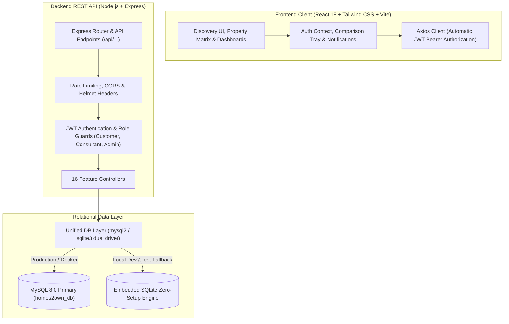
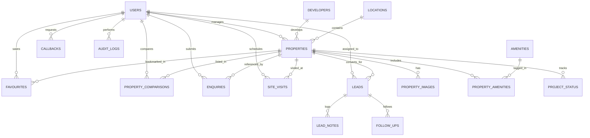

# HOMES2OWN — Mumbai Real Estate Consultancy Platform

> **A Production-Grade Full-Stack Real Estate Consultancy & Property Management Platform**  
> Tailored for the **Mumbai, Maharashtra, India** residential and commercial property markets.  
> Built with **React (Vite)**, **Tailwind CSS**, **Node.js**, **Express.js**, **MySQL 8.0**, **Jest + Supertest**, **Docker**, and **Jenkins**.

[](https://render.com/deploy?repo=https://github.com/swayam699/online-food-ordering-system)

---

## 📌 1. Platform Overview & Value Proposition

**HOMES2OWN** is an authentic, high-end real estate consultancy and property management web platform built specifically for the Mumbai luxury and prime property ecosystem. Designed to reject generic AI/vibe-coded clichés, the platform embraces an editorial architectural aesthetic inspired by modern Indian lifestyle publications and architectural monographs.

### Core Value Drivers:
- **Mumbai-Centric Architecture:** Structured from the ground up for Mumbai geography—20 distinct localities across South Mumbai, Western Suburbs, Central Mumbai, and Navi Mumbai/Thane.
- **Indian Pricing & Metric Integrity:** Native support for Indian numerical denominations (Crores `₹ Cr`, Lakhs `₹ L`) and carpet area in square feet (`sq.ft.`), with accurate per-sq.ft. analytics.
- **Consultancy Lead Pipeline:** Seamless multi-channel conversion including Private Viewings (Site Visits), Schedule a Callback, General Enquiries, and Direct WhatsApp Advisory integration.
- **Consultant CRM & Deal Tracking:** Proprietary pipeline dashboard for property advisors with multi-stage lead tracking, internal consultant notes, and visit scheduling.
- **Executive Administration Console:** Business metrics with closed-deal value calculations, Recharts distribution visuals, and complete property lifecycle management.

---

## 🎨 2. Brand & Visual Identity

The design system establishes trust, sophistication, and timeless understated luxury:

| Token | Hex Code | Purpose |
| :--- | :--- | :--- |
| **Warm Ivory** | `#F7F5F0` | Warm, non-sterile canvas background for editorial comfort |
| **Deep Charcoal** | `#242521` | High-contrast editorial typography, prominent headers, solid actions |
| **Muted Stone** | `#D9D4C9` | Architectural grid borders, card outlines, subtle dividers |
| **Restrained Olive** | `#777B5A` | Brand accent: badges, active tabs, price highlights, advisory emblems |
| **Muted Ash** | `#71716D` | Subtitles, metadata, regulatory notices, secondary text |

### Typography
- **Headings & Brand Title:** `Cormorant Garamond` (Editorial Serif)
- **Interface & Data:** `Plus Jakarta Sans` (Clean, contemporary sans-serif)

---

## 🏛️ 3. System Architecture



---

## 🛠️ 4. Technology Stack & Justification

| Layer | Technology | Justification |
| :--- | :--- | :--- |
| **Frontend UI** | React 18 (Vite) | Lightning-fast HMR, component reusability, modular architecture |
| **Styling** | Tailwind CSS 3.4 | Editorial utility-first styling with custom palette and typography |
| **Routing** | React Router v7 | Declarative routing with URL parameter filter persistence |
| **Data Visuals** | Recharts | Responsive SVG charts for property distributions and lead stages |
| **Icons** | Lucide React | Clean, scalable vector iconography |
| **Backend Runtime**| Node.js 20+ & Express 4 | High-throughput asynchronous REST API with lean memory profile |
| **Database** | MySQL 8.0 + SQLite | ACID compliance, relational integrity, dual-driver local zero-friction setup |
| **Authentication** | JWT & bcryptjs | Stateless authorization with 10 salt rounds password hashing |
| **Testing** | Jest 29 + Supertest 7 | Automated integration coverage spanning all 18 Section 27 test cases |
| **Containerization**| Docker & Docker Compose | Multi-stage production container builds with Nginx alpine reverse proxy |
| **CI/CD** | Jenkinsfile | 8-stage declarative pipeline validating lint, test, build, and Docker release |

---

## 🗄️ 5. Database Schema & Entity Relationships

The schema consists of **17 normalized relational tables**:



### Key Tables Summary:
1. `users` — Authentication, role (`customer`, `consultant`, `admin`), profile data.
2. `developers` — Top Mumbai builders (Godrej, Lodha, Oberoi, Prestige, Adani, etc.).
3. `locations` — 20 Mumbai localities with region, PIN code, and latitude/longitude.
4. `properties` — Listings with transaction type, price, carpet area, configuration, floor, parking, possession status, RERA number.
5. `property_images` — Multi-image gallery with display order, primary flags, and alt text.
6. `amenities` & `property_amenities` — Architectural features (Private Infinity Pool, Concierge, EV Charging, Helipad, etc.).
7. `favourites` — User saved properties list with unique composite key `(user_id, property_id)`.
8. `property_comparisons` — Comparison tray (enforced max 3 properties).
9. `enquiries` — Inbound general enquiries with status tracking (`new`, `contacted`, `converted`, `closed`).
10. `site_visits` — Scheduled physical and virtual property inspections with future date validation.
11. `callbacks` — Immediate callback intake with preferred time slot and notes.
12. `leads` — CRM pipeline with stages (`New`, `Contacted`, `Site Visit Scheduled`, `Negotiation`, `Closed Won`, `Closed Lost`) and estimated deal value.
13. `lead_notes` — Timestamped consultant notes attached to CRM leads.
14. `follow_ups` — Scheduled reminder follow-ups for consultants.
15. `project_status` — Construction milestones, possession dates, and progress percentage.
16. `audit_logs` — Administrative audit trail of system events.

---

## 📡 6. REST API Documentation

All API responses follow the standard JSON envelope:
`{ "success": true, "data": ..., "message": "..." }` or `{ "success": false, "error": "..." }`.

| Endpoint | Method | Role | Description |
| :--- | :--- | :--- | :--- |
| `/api/health` | GET | Public | Health status check and system timestamp |
| `/api/auth/register` | POST | Public | Register customer account with email/password validation |
| `/api/auth/login` | POST | Public | Authenticate user and return signed JWT token |
| `/api/auth/me` | GET | Authenticated | Retrieve current user profile and role details |
| `/api/properties` | GET | Public | Search and filter listings (price, BHK, locality, pagination) |
| `/api/properties/:idOrSlug` | GET | Public | Fetch comprehensive listing with gallery, builder, amenities |
| `/api/properties` | POST | Admin | Create a new property listing |
| `/api/properties/:id` | PUT | Admin | Update property details and status |
| `/api/properties/:id` | DELETE | Admin | Soft or hard delete property listing |
| `/api/locations` | GET | Public | List all 20 Mumbai localities with live listing counts |
| `/api/developers` | GET | Public | List developer profiles and total project portfolios |
| `/api/amenities` | GET | Public | Retrieve curated residential and commercial amenities |
| `/api/favourites` | GET | Customer | Retrieve current user saved properties |
| `/api/favourites/:propertyId` | POST | Customer | Toggle or add property to user saved list |
| `/api/favourites/:propertyId` | DELETE | Customer | Remove property from user saved list |
| `/api/comparisons` | GET | Authenticated | Retrieve properties in the user comparison tray |
| `/api/comparisons/:propertyId` | POST | Authenticated | Add property to comparison (enforced max 3) |
| `/api/comparisons/:propertyId` | DELETE | Authenticated | Remove property from comparison |
| `/api/enquiries` | POST | Public/User | Submit new general enquiry |
| `/api/enquiries/my` | GET | Customer | View personal submitted enquiries |
| `/api/enquiries` | GET | Consultant/Admin| List all client enquiries across platform |
| `/api/enquiries/:id/status`| PATCH| Consultant/Admin| Update enquiry status and notes |
| `/api/site-visits` | POST | Customer | Schedule a site visit (validated future date) |
| `/api/site-visits/my` | GET | Customer | View personal scheduled site visits |
| `/api/site-visits` | GET | Consultant/Admin| View all scheduled site visits |
| `/api/site-visits/:id/status`| PATCH| Consultant/Admin| Confirm, reschedule, or complete visit |
| `/api/callbacks` | POST | Public/User | Request priority phone callback |
| `/api/leads` | GET | Consultant/Admin| View CRM lead pipeline with stage filtering |
| `/api/leads/:id` | GET | Consultant/Admin| View full CRM lead timeline and interaction history |
| `/api/leads/:id/notes` | POST | Consultant/Admin| Append internal consultant note to lead |
| `/api/leads/:id/stage` | PATCH| Consultant/Admin| Move lead through pipeline stages |
| `/api/admin/metrics` | GET | Admin | Aggregated stats: listings, leads, visits, closed revenue |
| `/api/reports/analytics` | GET | Consultant/Admin| Data points for Recharts (by locality, stage, BHK) |

---

## 🔒 7. Security Model & Data Protection

- **Password Hashing:** Passwords hashed with `bcryptjs` using 10 salt rounds. Plaintext passwords never stored.
- **Stateless JWT Tokens:** Signed tokens verifying identity, user ID, and role. Tokens expire in 7 days.
- **Role-Based Access Control (RBAC):** Middleware checks verify whether a user is `customer`, `consultant`, or `admin` before granting access to sensitive routes.
- **SQL Injection Prevention:** Parameterized SQL queries (`?`) across both MySQL and SQLite drivers.
- **Rate Limiting:** `express-rate-limit` prevents brute-force attempts on sensitive and public routes (200 requests per 15-minute window).
- **CORS & Input Sanitization:** Explicit CORS origin restriction and clean input validation on all lead forms.

---

## 🚀 8. Setup & Installation Guide

### Prerequisites:
- **Node.js** v20.0.0 or higher
- **npm** v9.0.0 or higher
- **MySQL 8.0** (optional; SQLite fallback initializes automatically if MySQL is absent)
- **Docker & Docker Compose** (optional, for containerized run)

### Option A: Local Development Setup (Quickest)

1. **Clone the repository:**
   ```bash
   git clone https://github.com/swayam699/online-food-ordering-system.git homes2own
   cd homes2own
   ```

2. **Configure Environment Variables:**
   ```bash
   cp .env.example .env
   ```

3. **Install Backend Dependencies:**
   ```bash
   cd backend
   npm install
   ```

4. **Install Frontend Dependencies:**
   ```bash
   cd ../frontend
   npm install
   ```

5. **Start Development Servers:**
   - In terminal 1 (Backend API on port 5000):
     ```bash
     cd backend
     npm run dev
     ```
   - In terminal 2 (Vite Client on port 5173):
     ```bash
     cd frontend
     npm run dev
     ```

6. Open your browser at **`http://localhost:5173`**.

---

### Option B: Docker Compose Deployment

Run the complete 3-tier production stack (MySQL 8.0 container + Node.js backend container + Nginx frontend container):

```bash
docker-compose up --build -d
```

- **Frontend Client (Nginx):** `http://localhost`
- **Backend API:** `http://localhost:5000/api`
- **MySQL Database:** `localhost:3306`

To shut down:
```bash
docker-compose down
```

---

## 🧪 9. Testing Guide

The platform includes an automated integration and API test suite covering all 18 Section 27 test scenarios using Jest and Supertest.

Run the test suite:
```bash
cd backend
npm test
```

### What is tested:
- System Healthcheck
- Customer Registration (unique email validation, field integrity)
- Customer, Consultant, and Admin Login (JWT issuance)
- Auth Session verification (`/api/auth/me`)
- Property Listing, Search, BHK Filters, Transaction Type Filters, Price Sorting
- Full Property Specification Detail retrieval
- 20 Mumbai Localities and Developer catalogs
- Favourites Add, Duplicate Handling, Check, List, and Delete
- Comparison Matrix Add, List, and Delete (enforced max 3)
- Lead & Enquiry Ingestion, Personal Enquiry view, Consultant pipeline update
- Site Visit Scheduling with future-date validation (rejection of past dates)
- Callback requests intake
- Consultant CRM Leads, Timeline history, and Internal Notes
- Admin Authorization restrictions (Customer role rejection)
- Admin Aggregated Metrics & Recharts Analytics

---

## 🔁 10. CI/CD Pipeline (Jenkinsfile)

The repository includes a declarative `Jenkinsfile` with 8 sequential stages:
1. **Checkout:** Clones the latest branch from Git SCM.
2. **Environment Validation:** Asserts Node, npm, and Docker environment availability.
3. **Install Backend Dependencies:** Executes `npm ci` in `backend/`.
4. **Install Frontend Dependencies:** Executes `npm ci` in `frontend/`.
5. **Lint & Code Quality Checks:** Validates Node syntax on server entrypoints.
6. **Run Backend Integration Tests:** Runs Jest suite and Supertest assertions.
7. **Build Frontend Assets:** Compiles production bundle with Vite.
8. **Build Docker Images:** Builds backend and frontend production images (conditional on main branch).

---

## 🔑 11. Demo Accounts & Credentials

For quick evaluation, pre-seeded accounts with 1-click login buttons are available on the **`/login`** page:

| Account Type | Email Address | Password | Role & Permissions |
| :--- | :--- | :--- | :--- |
| **Customer** | `customer@homes2own.com` | `Password123!` | Discovery, Favourites, Comparison tray, Book visits, Inquiries |
| **Consultant** | `consultant@homes2own.com` | `Password123!` | CRM Lead pipeline, Client notes, Visit scheduling, Lead status |
| **Administrator** | `admin@homes2own.com` | `Password123!` | Executive analytics, Closed deals value, Full property CRUD |

---

## 🏙️ 12. Key Features Walkthrough

### 1. Customer Discovery Flow
- **Live Search Bar:** Search by keyword, transaction type (`Buy` / `Rent`), locality, and budget.
- **Filter Sidebar & Mobile Drawer:** Filter by BHK (1 BHK to 5+ BHK), property type (`Apartment`, `Penthouse`, `Villa`, `Office`), possession status (`Ready to Move`, `Under Construction`), and specific amenities.
- **Sort Options:** Price: Low to High, Price: High to Low, Area: Largest, Newest First.

### 2. Side-by-Side Comparison Matrix
- Compare up to 3 properties simultaneously.
- Compares price, carpet area, configuration, price/sq.ft., floor, parking, possession status, developer, and full amenity tags side by side.

### 3. Consultation & Site Visit Booking
- Schedule a private viewing with date picker and preferred time slot.
- Instant WhatsApp consultation with pre-filled message and property ID reference.

### 4. Consultant CRM Dashboard
- Track leads through all stages: `New`, `Contacted`, `Site Visit Scheduled`, `Negotiation`, `Closed Won`, `Closed Lost`.
- Log time-stamped internal consultation notes.
- Approve or reschedule site visits.

### 5. Admin Analytics Console
- Executive KPI Cards: Total Active Properties, Active Leads, Site Visits, Closed Revenue.
- Recharts Visualizations: Properties by Mumbai Region, Lead Pipeline Breakdown, Configuration Distribution.
- Comprehensive Property CRUD Modal with real-time editing and safe delete confirmation.

---

## 🌆 13. Mumbai Real Estate Context

Mumbai is India’s financial capital and the most valuable real estate market in South Asia:
- **Localities Represented:** South Mumbai (Colaba, Marine Drive, Malabar Hill, Worli), Western Suburbs (Bandra West, Khar, Juhu, Andheri West), Central Mumbai (Lower Parel, Dadar, Wadala), and Eastern/Tech hubs (BKC, Powai, Thane).
- **RERA Compliance:** Demonstrates compliance with Maharashtra Real Estate Regulatory Authority (MahaRERA) guidelines with clear RERA certificate identification.
- **Pricing Landscape:** From luxury apartments at ₹45,000–₹1,20,000 per sq.ft. in South Mumbai to contemporary developments in Powai and Thane.

---

## 🗺️ 14. Future Roadmap

- [ ] Interactive Leaflet/Mapbox Mumbai GIS map view with metro connectivity layers
- [ ] 360-degree Matterport virtual property tour viewer integration
- [ ] AI-powered Mumbai carpet area property valuation calculator
- [ ] Automated SMS & WhatsApp status notifications via Twilio / Gupshup

---

## 📄 15. License & Attribution

This project is licensed under the ISC License.  
All architectural demo imagery and branding elements are curated for illustrative consultancy demonstration purposes.

© 2026 **HOMES2OWN Real Estate Advisory**. All rights reserved.
